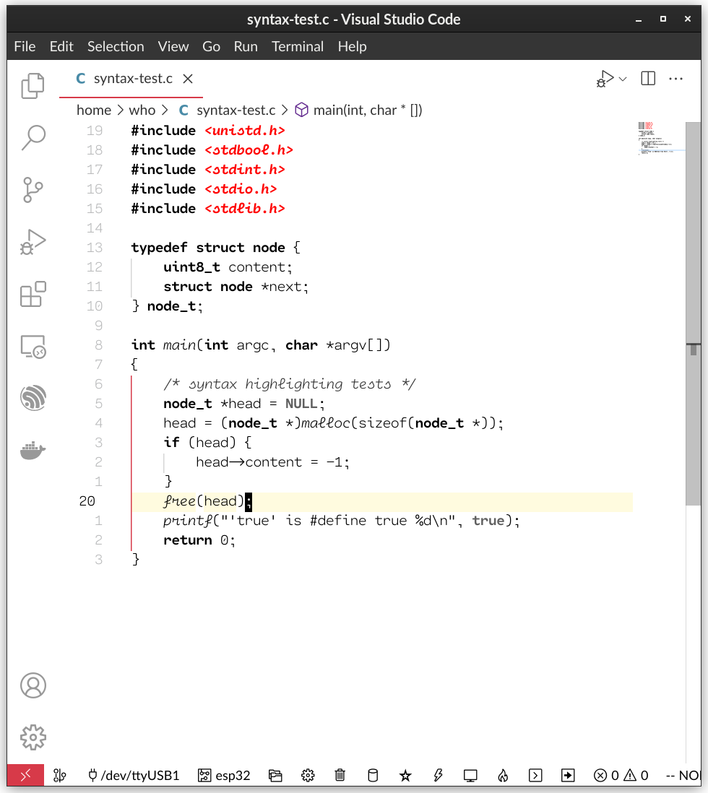

# Low Distraction Theme

This theme uses just a few colors (mainly black and red) to highlight syntaxes.  It has been tested
with C/python, taking advantage of Semantic Highlight.

## Previews

### Light mode



## Tips

Use these global settings to enable bracket-pair matching and guide lines.

```json
{
  "editor.guides.bracketPairs": "active",
  "editor.guides.bracketPairsHorizontal": false,
}
```

What font is used in the screenshots?

```json
{
  "editor.fontFamily": "Cartograph CF",
  "editor.fontLigatures": true,
  "editor.fontSize": 13,
  "editor.fontWeight": "200",
  "editor.letterSpacing": -0.5,
}
```
## Acknowledgements

Borrowed the code for clean borderless UI and base colors from [Github Light Theme](https://marketplace.visualstudio.com/items?itemName=Hyzeta.vscode-theme-github-light)